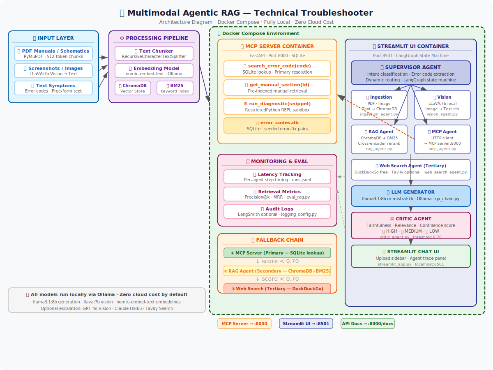

# 🤖 Multimodal Agentic RAG — Technical Troubleshooter

> Upload a PDF manual, paste a screenshot of the error, describe the symptom — get a grounded, cited diagnosis.



---

## ✨ What it does

This is a **fully local, zero-cloud-cost** AI troubleshooting assistant that runs as two Docker containers on your laptop. A user can upload PDF manuals, device schematics, or screenshots of error screens alongside a text description of the problem. An orchestrated network of specialised agents diagnoses the issue using a deterministic fallback chain:

1. **MCP Server** (fastest): looks up the exact error code in a local SQLite database
2. **RAG Agent** (secondary): hybrid ChromaDB + BM25 retrieval over uploaded documents, reranked by a cross-encoder
3. **Web Search** (last resort): DuckDuckGo (free) or Tavily

Before any answer reaches the user, a **Critic Agent** scores it for faithfulness and relevance. If the score is below the configured threshold (default 0.70), the Supervisor automatically escalates to the next tier.

---

## 🏗️ Architecture

```
┌─────────────────────────────────────────────────────────┐
│              Docker Compose Environment                  │
│                                                         │
│  ┌────────────────────┐   ┌─────────────────────────┐  │
│  │   MCP Server :8000 │   │  Streamlit UI  :8501    │  │
│  │                    │   │                         │  │
│  │  search_error_code │◄──│  Supervisor (LangGraph) │  │
│  │  get_manual_section│   │  Vision Agent (LLaVA)   │  │
│  │  run_diagnostic    │   │  RAG Agent  (ChromaDB)  │  │
│  │  SQLite error DB   │   │  Web Search (DuckDuckGo)│  │
│  └────────────────────┘   │  LLM (llama3.1:8b)      │  │
│                           │  Critic Agent           │  │
│  ┌────────────────────┐   └─────────────────────────┘  │
│  │  Ollama  :11434    │                                 │
│  │  llama3.1:8b       │◄── All containers talk to      │
│  │  llava:7b          │    Ollama via Docker network    │
│  │  nomic-embed-text  │                                 │
│  └────────────────────┘                                 │
└─────────────────────────────────────────────────────────┘
```

**Fallback chain:**
```
① MCP Lookup  →  ② RAG Retrieval  →  ③ Web Search
      ↓                 ↓                   ↓
  score < 0.70     score < 0.70         always generate
      ↓                 ↓
  escalate →      escalate →          Critic scores
```

---

## 🛠️ Tech Stack

| Component | Tool | Cost |
|---|---|---|
| LLM (generation + supervisor) | `llama3.1:8b` via Ollama | **Free** |
| Vision (image → text) | `llava:7b` via Ollama | **Free** |
| Embeddings | `nomic-embed-text` via Ollama | **Free** |
| Vector store | ChromaDB (embedded) | **Free** |
| Keyword search | BM25 (`rank-bm25`) | **Free** |
| Reranker | `ms-marco-MiniLM` cross-encoder | **Free** |
| Agent orchestration | LangGraph | **Free** |
| MCP server | FastAPI + SQLite | **Free** |
| Web search fallback | DuckDuckGo Search | **Free** |
| UI | Streamlit | **Free** |
| **Realistic monthly total** | | **$0** |

Optional paid upgrades (not required): Tavily API (1000 calls/month free), LangSmith tracing (5000 traces/month free), OpenAI GPT-4o Vision for harder images (~$1–2/month).

---

## 🚀 Quick Start

### Prerequisites

- Docker Desktop installed and running
- 16 GB RAM recommended (8 GB minimum with quantised models)
- ~12 GB free disk space (Ollama models)

### 1. Clone and configure

```bash
git clone https://github.com/YOUR_USERNAME/multimodal-rag-troubleshooter
cd multimodal-rag-troubleshooter
cp .env.example .env
# Review .env — no changes required for local-only operation
```

### 2. Start Ollama and pull models (one-time, ~10 GB)

```bash
# Start Ollama container first
docker compose up ollama -d

# Pull required models
bash scripts/setup.sh
```

> **Low-RAM tip:** Edit `.env` and set `OLLAMA_LLM_MODEL=mistral:7b` (~4.1 GB vs 4.7 GB for llama3.1).

### 3. Seed the error database

```bash
python scripts/seed_error_db.py
```

### 4. Start all services

```bash
docker compose up --build
```

| Service | URL |
|---|---|
| Streamlit UI | http://localhost:8501 |
| MCP Server | http://localhost:8000 |
| API Docs (Swagger) | http://localhost:8000/docs |

---

## 🎬 Demo Flow

1. Open http://localhost:8501
2. In the sidebar, upload `data/sample_docs/network_card_manual.txt`
3. Type: `"My network card shows error 0x4F on boot with amber LED blinking"`
4. Watch the agent trace panel to see MCP → Critic flow
5. Upload a screenshot (any PNG) to see LLaVA vision processing

---

## 📁 Repository Structure

```
multimodal-rag-troubleshooter/
├── .env.example              # Environment template (copy to .env)
├── docker-compose.yml        # Ollama + MCP server + Streamlit UI
├── requirements.txt
│
├── services/
│   ├── app/
│   │   ├── Dockerfile
│   │   ├── streamlit_app.py  # Main UI entry point
│   │   └── core/config.py    # Settings from .env
│   │
│   ├── supervisor/
│   │   ├── graph.py          # LangGraph state machine
│   │   ├── nodes.py          # Agent node implementations
│   │   ├── state.py          # Shared AgentState TypedDict
│   │   └── prompts.py        # All system prompts (versioned)
│   │
│   ├── agents/
│   │   ├── ingestion_agent.py
│   │   ├── vision_agent.py   # LLaVA image → text
│   │   ├── rag_agent.py      # ChromaDB + BM25 + cross-encoder
│   │   ├── mcp_agent.py      # HTTP client for MCP server
│   │   ├── web_search_agent.py
│   │   └── critic_agent.py   # Quality gate scorer
│   │
│   └── mcp_server/
│       ├── Dockerfile
│       ├── server.py         # FastAPI MCP microservice
│       └── tools/
│           ├── error_lookup.py   # SQLite error code DB
│           └── python_repl.py    # RestrictedPython sandbox
│
├── ingestion/
│   ├── pdf_processor.py      # PyMuPDF → chunks
│   ├── image_processor.py    # Image → vision → chunk
│   ├── embedder.py           # nomic-embed-text via Ollama
│   └── chroma_client.py      # ChromaDB wrapper
│
├── data/sample_docs/         # Sample manuals for demo
├── evaluation/               # Offline eval scripts + test queries
├── monitoring/               # Structured JSON logging
├── scripts/                  # setup.sh, seed_error_db.py
└── tests/                    # pytest test suite
```

---

## 🧪 Running Tests

```bash
# Install test deps (if running outside Docker)
pip install -r requirements.txt

# Run all tests
pytest tests/ -v

# Run specific test file
pytest tests/test_mcp_server.py -v
```

---

## ⚙️ Configuration

All settings are in `.env`. Key knobs:

| Variable | Default | Effect |
|---|---|---|
| `OLLAMA_LLM_MODEL` | `llama3.1:8b` | Swap to `mistral:7b` on low-RAM machines |
| `CRITIC_THRESHOLD` | `0.70` | Lower = more permissive; raise to force web search |
| `TOP_K_RESULTS` | `5` | Chunks retrieved before reranking |
| `RERANK_TOP_N` | `3` | Chunks passed to LLM after reranking |
| `TAVILY_API_KEY` | *(empty)* | Leave blank to use free DuckDuckGo |

---

## 📊 Evaluation

```bash
python evaluation/score_run.py \
  --queries evaluation/test_queries.json \
  --out evaluation/results/run_001.json
```

Outputs aggregate metrics: mean confidence, source tier accuracy, mean latency, tier distribution.

---

## 🔐 Security Notes

- **No data leaves your machine** by default — all models run locally via Ollama
- The `run_diagnostic` MCP tool uses `RestrictedPython` (no `import`, no file I/O)
- API keys are read from `.env` — never hardcoded
- `.env` is excluded from Git via `.gitignore`

---

## 📝 License

MIT — see [LICENSE](LICENSE)
